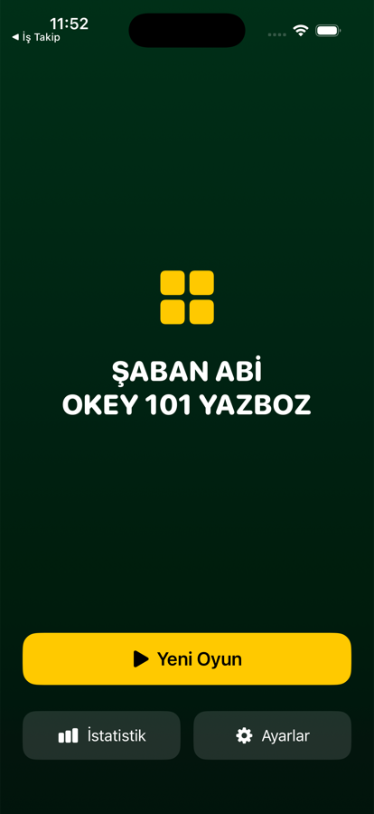
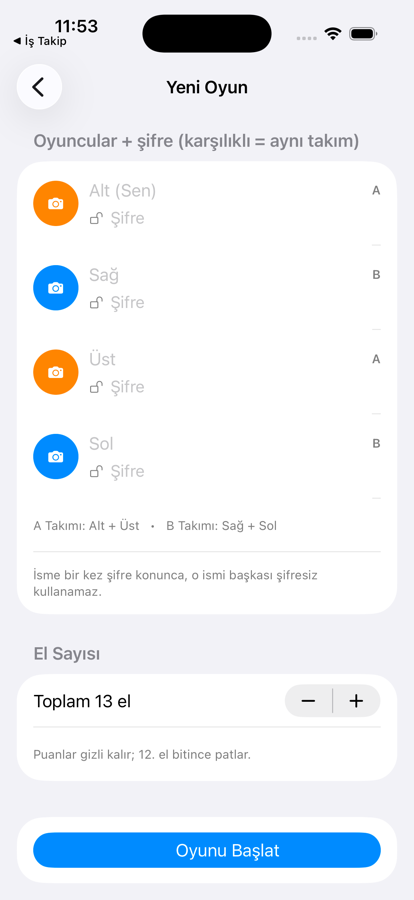
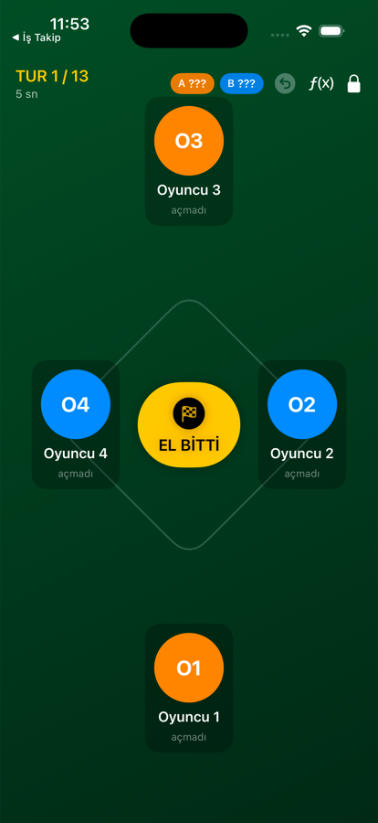

# Şaban Abi Okey 101 Yazboz

Okey 101 için kâğıt yazboz yerine geçen iPhone uygulaması. Dört oyuncu, iki takım,
el el ceza ve puan takibi — üstüne sesli anlatım.

## Ekran Görüntüleri

<table>
<tr>
<td width="33%"> <b>Açılış</b></td>
<td width="33%"> <b>Kurulum</b> — oyuncular, takımlar, el sayısı</td>
<td width="33%"> <b>Masa</b> — oturma düzeni, gizli puanlar</td>
</tr>
</table>

## Nasıl çalışır

**Masa düzeni.** Oyuncular gerçek masadaki gibi yerleşir: alt, sağ, üst, sol.
Karşılıklı oturanlar aynı takımdır — alt + üst A takımı, sağ + sol B takımı.

**Gizli puan.** Oyun boyunca takım puanları `???` olarak durur ve son ele bir el
kala açılır. Kimse "kaç kaldı" hesabı yapıp oyunu ona göre oynayamaz.

**Üç ayrı sayaç.** Her oyuncu için ayrı ayrı tutulur: karşı takıma yazdırdığı ceza,
kendi yediği ceza ve elinde kalan taş. Oyun sonu istatistikleri bunlardan çıkar.

**Oyuncu şifresi.** Bir isme bir kez şifre konunca o ismi başkası şifresiz
kullanamaz; istatistikler kişiye bağlı kalır.

**Sesli anlatım.** `SesliMetinler.txt` içinde her senaryo için birden çok cümle
vardır, o an gelince biri rastgele seçilip okunur. Metinler `{oyuncu}` ve `{hedef}`
değişkenlerini destekler — dosyayı düzenleyip kendi ağzınla konuşturabilirsin.

## Kaynak düzeni

| Dosya | İçerik |
| --- | --- |
| `Models.swift` | Takım, oyuncu, el ve oyun modelleri |
| `GameStore.swift` | Oyun durumu, puanlama, kayıt |
| `SetupView.swift` | Oyuncu ve el sayısı kurulumu |
| `GameView.swift` | Masa ekranı |
| `PlayerActionView.swift` | El içi ceza/işlem girişi |
| `RevealView.swift` | Puanların açıldığı ekran |
| `EndGameView.swift` | Oyun sonu |
| `StatsView.swift` | İstatistikler |
| `AuthManager.swift` / `AuthGateView.swift` | Oyuncu şifreleri |
| `VoiceManager.swift` / `SesliMetinler.txt` | Sesli anlatım |

## Derleme

Xcode ile `OkeyYazboz.xcodeproj` açılır, cihaz ya da simülatör seçilip çalıştırılır.
